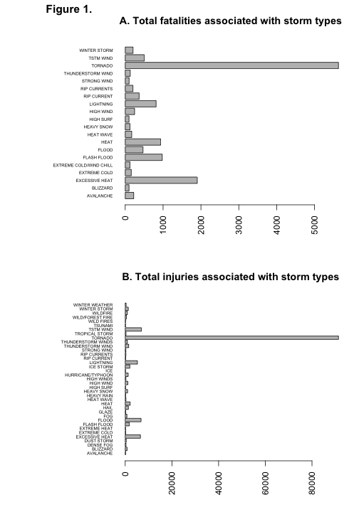
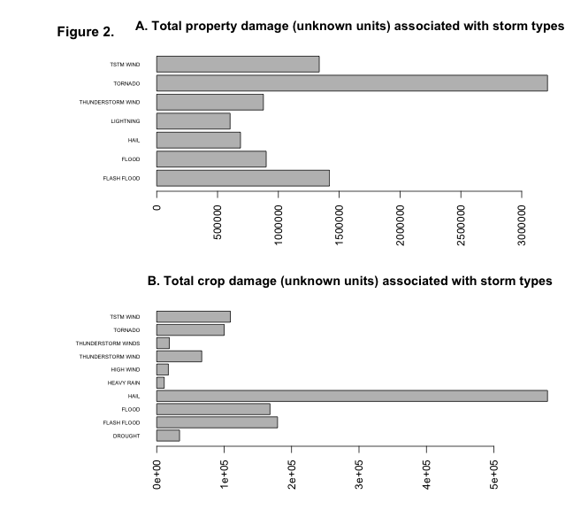

Tornadoes and Hail - Identifying storm types of greatest health and economic cost to the USA (1950 - 2011).
========================================================

## Synopsis
Data from the U.S. National Oceanic and Atmospheric Administration's (NOAA) storm database was examined for the years between 1950 and 2011.
The sum cost to human health and the economy was calculated and broken down according to the storm type.  Over this period of time, tornadoes have had the largest impact on total deaths, injuries and property loss while hail has been the storm type associated with the largest losses in crops.  

## Data processing

Data was downloaded from the provided source and read into a variable called data.  No codebook was provided for the data set.


```r
setwd(".")
download.file("https://d396qusza40orc.cloudfront.net/repdata%2Fdata%2FStormData.csv.bz2", 
    dest = "tmp.bz2", method = "curl")
data <- read.csv("tmp.bz2")


# initial look at table
colnames(data)
```

```
##  [1] "STATE__"    "BGN_DATE"   "BGN_TIME"   "TIME_ZONE"  "COUNTY"    
##  [6] "COUNTYNAME" "STATE"      "EVTYPE"     "BGN_RANGE"  "BGN_AZI"   
## [11] "BGN_LOCATI" "END_DATE"   "END_TIME"   "COUNTY_END" "COUNTYENDN"
## [16] "END_RANGE"  "END_AZI"    "END_LOCATI" "LENGTH"     "WIDTH"     
## [21] "F"          "MAG"        "FATALITIES" "INJURIES"   "PROPDMG"   
## [26] "PROPDMGEXP" "CROPDMG"    "CROPDMGEXP" "WFO"        "STATEOFFIC"
## [31] "ZONENAMES"  "LATITUDE"   "LONGITUDE"  "LATITUDE_E" "LONGITUDE_"
## [36] "REMARKS"    "REFNUM"
```

```r

dim(data)  #902297     37
```

```
## [1] 902297     37
```

```r

# no code book was made available for this data set and it is not available
# at any obvious location including
# http://www1.ncdc.noaa.gov/pub/data/swdi/stormevents/csvfiles/Storm-Data-Export-Format.docx
# or the documents suggested by the course page
```


## Results

The total number of reported fatalities and injuries due to storms between 1950 and 2011 were both calculated  for each storm type (column EVTYPE).  The sums were plotted as a bar plot (Figure 1).  Storm types responsible for fewer than 100 fatalities or injuries were removed from the plot.


```r

par.original <- par(las = 2)  # make label text perpendicular to axis
par(mfrow = c(2, 1))
par(mar = c(5, 12, 4, 2))  # increase y-axis margin.

# look at total deaths per event type
fat <- tapply(data$FATALITIES, INDEX = data$EVTYPE, sum)
big.fat <- fat[fat > 100]
barplot(big.fat, main = "A. Total fatalities associated with storm types", horiz = TRUE, 
    cex.names = 0.5)
mtext("Figure 1.", side = 2, line = 3, at = 30, font = 2, cex = 1.3)

# look at total injuries
inj <- tapply(data$INJURIES, INDEX = data$EVTYPE, sum)
big.inj <- inj[inj > 100]
barplot(big.inj, main = "B. Total injuries associated with storm types", horiz = TRUE, 
    cex.names = 0.5)
```

 


**Figure 1.  Total fatalities and injuries associated with storm types.** 

The total of all reported property damage and crop damage between 1950 and 2011 were both calculated  for each storm type (column EVTYPE).  The sums were plotted as a bar plot (Figure 2).  Storm types responsible for less than 500000(unkown units) in property or crop damage were removed from the plot.


```r

par(par.original)
par.original <- par(las = 2)  # make label text perpendicular to axis
par(mfrow = c(2, 1))
par(mar = c(5, 12, 4, 2))  # increase y-axis margin.


# look at total property damage
prop <- tapply(data$PROPDMG, INDEX = data$EVTYPE, sum)
big.prop <- prop[prop > 5e+05]
barplot(big.prop, main = "A. Total property damage (unknown units) associated with storm types", 
    horiz = TRUE, cex.names = 0.5)
mtext("Figure 2.", side = 2, line = 3, at = 10, font = 2, cex = 1.3)

# look at total crop damage
crop <- tapply(data$CROPDMG, INDEX = data$EVTYPE, sum)
big.crop <- crop[crop > 10000]
barplot(big.crop, main = "B. Total crop damage (unknown units) associated with storm types", 
    horiz = TRUE, cex.names = 0.5)
```

 


**Figure 2.  Total property and crop damage costs associated with storm types.** 


```r
par(par.original)
```


## Conclusions


Across the United States, which types of events (as indicated in the EVTYPE variable) are most harmful with respect to population health?

From Figure 1, it appears that tornadoes were responsible for the largest proportion of deaths and injuries out of all storm types.  Excessive heat and flash floods were responsible for the next highest number but both these numbers were less than 30% of the number due to tornadoes.

Across the United States, which types of events have the greatest economic consequences?

From Figure 2, it appears that tornadoes were again the largest contributor to property damage.  However, for losses due to crop damage, hail was the largest contributor followed by flooding and then tornadoes.

A number of points should be kept in mind when drawing conclusions from these results. First, the losses due to different storm types were calculated over the entirety of 1950 to 2011 and for the entire USA.  The storm profiles shown in Figures 1 and 2 could differ significantly if one were to look at specific regions of the USA or specific time periods (say the last 10 years).  Finally, the analysis only applies to the data collected - if all storm types were not reported equally over time and geographic area, then the use of the data to represent reality is of course compromised. Other complicating factors include the possibility that some losses (due to the same event) have been reported multiple times by different reporting agencies.  It is difficult to assess data collection practice problems such as these since the data set did not come with a code book and its provenance is uncertain.


